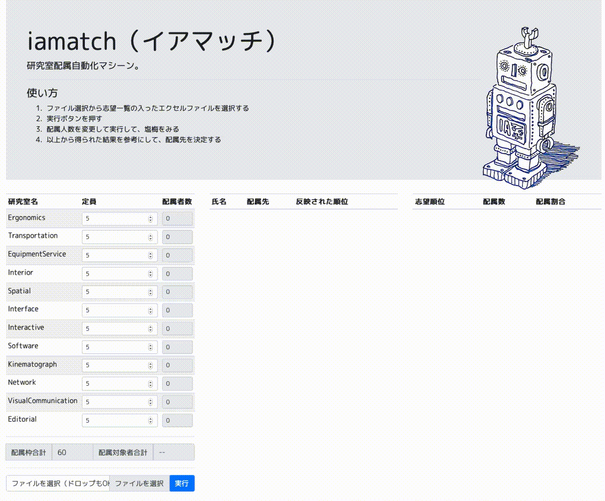

# iamatch（イアマッチ）とは


やあ、僕の名前はイアマッチ、とうきょうとりつだいがくのインダストリアルアート学科っていうところでうまれたけんきゅうしつはいぞくじどうマシーンなんだ。どの大学でもけんきゅうしつはいぞくっていうのがあるみたいなんだけど、はいぞくのしかたは大学ごとにちがっていて、毎年はいぞくのたびにたくさんのじんてきりそーすがついやされるんだって。

お茶の水女子大学のじょうほうかがくかでさいようされているけんきゅうしつはいぞくあるごりずむ（ http://www.is.ocha.ac.jp/~kudo/lab_algo.html ）っていうのがあって、これは2012年ノーベルけいざいがくしょうのあんていマッチングりろんをおうようしたものなんだって。インダストリアルアート学科でもこのやりかたでてすとしてみたところすごくよさそうだったので、けんきゅうしつはいぞくアルゴリズムとしてさいようしようとしたんだ。でもかくけんきゅうしつごとのスコアやはいぞくさぎょうがてまがかかってしまうので、てさぎょうによるミスがおおきなけねんだったみたい。

そこでぼくのでばんってわけなんだ。このけんきゅうしつじどうはいぞくアルゴリズムを、はいぞくさぎょうもふくめて完全じどうかしよう、という目的でぼくがつくられたんだ。

2020年11月2日追記：iamatchが開発された同じじきに、おおさかでんきつうしんだいがくも安定マッチングあるごりずむをつかって、けんきゅうしつはいぞくをしたんだって。https://www.osakac.ac.jp/news/2020/2191 


# How to use（つかいかた）


使うだけなら、したのリンクからためせるよ。
  * https://tomohikomukai.github.io/iamatch/
  * [サンプルデータ](https://github.com/TetsuakiBaba/iamatch/blob/master/sample_data/sample.xlsx )

## ローカルで実行する
1. クローンやダウンロードして、iamatchディレクトリからで下記コマンドでローカルサーバを立ち上げてね。
```
python -m http.server
  ```
2. ブラウザをひらいて localhost:8000 をたたいてね
3. ファイルの選択から sample_data/sample.xlsx をひらいてね。ただしくファイルが読み込まれると、配属対象者合計の人数が50になるよ。
4. 青色の実行ボタンをおしてみよう。配属結果一覧が表示されるよ。赤色になっている人は第一希望の研究室にならなかったひとだよ。それぞれのセルにマウスを乗せると、その人の詳細（GPA,取得単位数、希望研究室リスト）が表示されるよ。
5. 定員を調整して、3を繰り返してみてね。


# Requirements(ひつようなもの)
- read-excel-file：https://www.npmjs.com/package/read-excel-file
  - ぼくはCDNでよみこんでるけど、みんなはNPMインストールなど自由なやりかたでかまわないよ。
- p5.js

# Compatibility（どうさかんきょう）
js がどうさするブラウザがひつようだよ。ぼくがうごくことがかくにんされているかんきょうはしたのとおりだよ。でもそれいがいのかんきょうでもうごくかもしれないからためしてみてね。
- macOS(Safari, Firefox, Chrome)
- Windows(Edge, Chrome, Firefox)
- Linux(Chrome, Firefox)

# Contributor（ぼくをつくったひと）
- フジワラケイスケ [keisukefujiwara.com](https://www.keisukefujiwara.com)
- ムカイトモヒコ [TomohikoMukai@github](https://github.com/TomohikoMukai)
- ババテツアキ [TetsuakiBaba@github](https://github.com/TetsuakiBaba)
